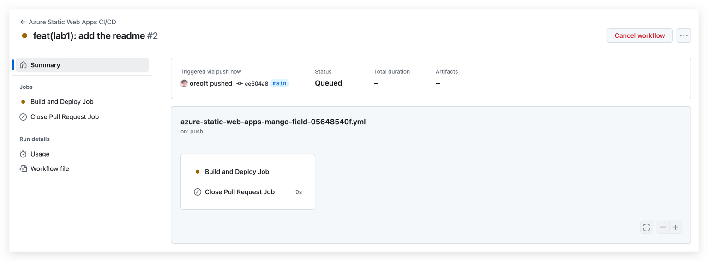
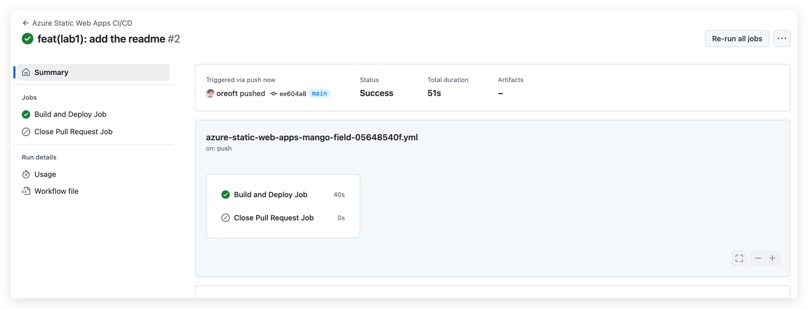

ITMD543-F24-Lab1

## Introduction

This project is a demonstration of automatic deployment of a static page using GitHub and Azure. It contains sample code
for a self-introduction page, primarily aimed at verifying the deployment process. The repository showcases how code
pushed to GitHub can automatically trigger a build and deploy process, seamlessly integrating development with
deployment.

Repository URL: https://github.com/oreoft/ITMD543-F24/Lab1
 
Deployment Success Page: https://mango-field-05648540f.5.azurestaticapps.net/

## Deployment

Pushing to GitHub will automatically trigger the build.

